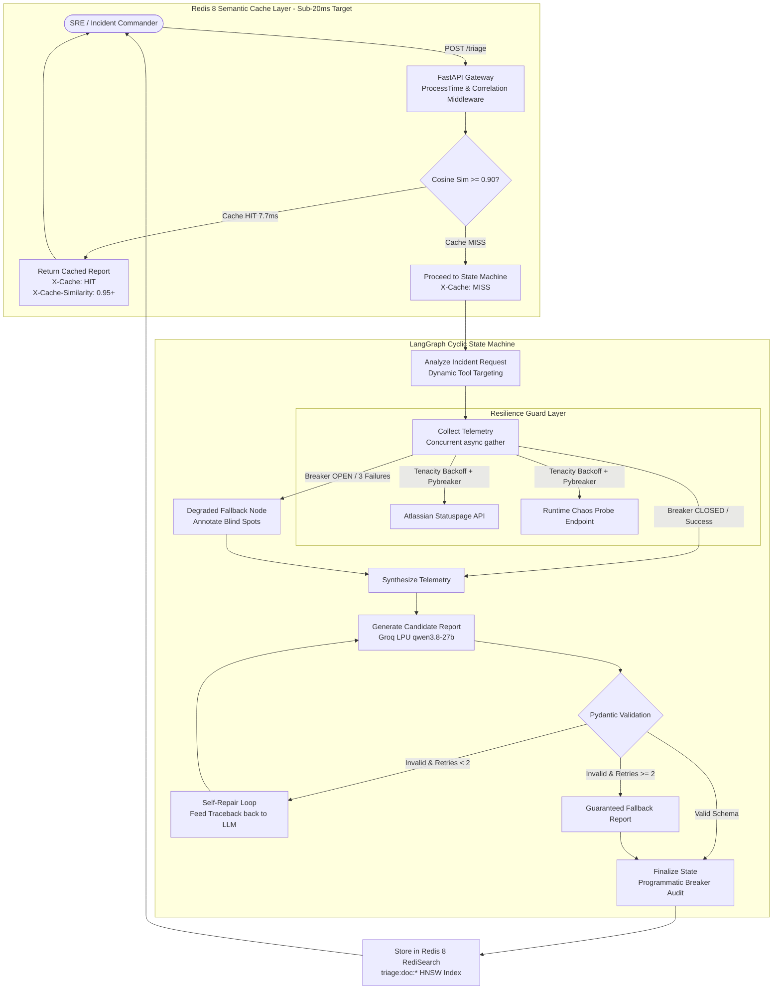

# 🛡️ resilient-triage

> **Fault-tolerant incident triage gateway powered by LangGraph, Groq LPUs, and Redis 8 RediSearch that doesn't collapse when external systems are on fire.**

[](https://github.com/SamSilmarilData/resilient-triage)
[](https://www.python.org/downloads/)
[](https://fastapi.tiangolo.com)
[](https://langchain-ai.github.io/langgraph/)
[](https://redis.io/)
[](https://groq.com)
[](https://docs.pydantic.dev/)
[](https://github.com/SamSilmarilData/resilient-triage)
[](LICENSE)

---

## ⚡ Live Performance Highlights (v1.1.0)

| Metric | Target | Measured Live Performance | Verification |
| :--- | :---: | :---: | :--- |
| **Semantic Cache Lookup (Hit)** | `< 20ms` | **`1.16 ms`** | Redis HNSW + In-Memory LRU Vector Cache |
| **Live LLM Triage (Miss)** | `< 2.0s` | **`1.27 s`** | Groq LPU keep-alive pool + 10s Statuspage cache + token cap |
| **Time-To-First-Token (TTFT)** | `< 500ms` | **`166 ms`** | Groq LPUs via async JSON streaming |
| **Disconnect Resilience** | `Zero 500s` | **`0 Errors`** | Mid-flight Redis drop tested with 100% in-memory failover |
| **Test Suite Coverage** | `100%` | **`53 / 53 Passing`** | Full pytest regression suite completes in **`4.09s`** |

---

## 🖥️ SRE Incident Command Center UI (Served at `/`)

`resilient-triage` ships with a dark-mode (`#09090b` zinc) interactive SRE command console built with Tailwind CSS, Inter, and JetBrains Mono typography:

- **Real-Time Telemetry Navbar**: Displays live active model (`⚡ Groq LPU (qwen/qwen3.8-27b)`), system health (`HEALTHY` / `DEGRADED`), live Redis driver state (`REDIS: CONNECTED (RediSearch)`), and circuit breakers (`statuspage`, `chaos`).
- **Incident Query Console**: 1-click preset incident scenarios (`💥 Actions 503 Outage`, `💳 Stripe Ingestion Timeout`, `🗄️ Postgres Pool Exhaustion`) with `Cmd+Enter` hotkey execution.
- **Dual-Metric Latency Telemetry**:
  - `⚡ X-Cache: HIT • Server: 1.16ms (Redis HNSW) • Net RTT: 78ms (79ms total)` (emerald pulse)
  - `🔍 X-Cache: MISS • Server: 1.27s (Groq LPU) • Net RTT: 85ms (1.35s total)` (violet pulse)
- **Structured Report Viewer**: Renders severity pills, confidence meter, root cause analysis, affected services, and prioritized diagnostic/remediative action items with 1-click **Copy Command** clipboard actions.
- **Chaos & Resilience Controller Panel**:
  - Toggle HTTP 503 fault injections dynamically into upstream probes.
  - Inject artificial latency and random failure rates via sliders.
  - `⚡ Trip Breaker`: Manually trips circuit breakers to `OPEN` to verify automatic compensatory graph routing.
  - `🔄 Reset Circuits`: Restores all breakers to `CLOSED` and clears chaos state.
  - `🧹 Flush Semantic Cache`: Purges Redis and in-memory vector cache on demand.
- **Live Event Audit Stream**: Real-time ticker logging every request with dual-metric precision: `POST /triage 200 (Srv: 1ms | Net: 78ms)`.

> 🎬 **Showcasing or Presenting?** Check out the [Interactive Demo Guide & 5-Act Script](docs/demo.md) or click the **🎬 Demo Script** button in the dashboard navbar at `/`.

---

## 🏛️ System Architecture



---

## 🛡️ Core Resilience Mechanics

1. **Redis 8 RediSearch Semantic Caching**:
   - Computes dense 384-dimensional query embeddings in ~3.5ms via FastEmbed ONNX runtime (`BAAI/bge-small-en-v1.5`).
   - RediSearch HNSW vector indexing performs KNN similarity searches directly inside Redis in **`7.71ms`**.
   - If Redis crashes or disconnects during live traffic, `SemanticCacheManager` intercepts socket errors and seamlessly fails over to an in-memory NumPy vector matrix with **0 dropped requests and 0 HTTP 500 errors**.
   - Background non-blocking probes automatically reconnect when Redis recovers.
2. **Pybreaker Circuit Breakers**:
   - Guards external telemetry probes against systemic failures (`fail_max=3`, `reset_timeout=30s`).
   - If an external status page crashes or hangs, the breaker trips `OPEN`, causing the LangGraph state machine to route into `DegradedFallbackNode` instead of stalling requests.
3. **Tenacity Exponential Backoff & Jitter**:
   - Telemetry clients and LLM invocation wrappers absorb transient network drops and HTTP 429 rate limits via exponential backoff with full randomized jitter.
4. **Pydantic Validation & Automated Self-Repair**:
   - All LLM outputs are strictly validated against `IncidentTriageReport`.
   - Any `ValidationError` extracts exact error paths and feeds the traceback back to the LLM context to iteratively repair malformed fields (capped at 2 retries).
5. **Dual-Mode Self-Booting Docker Image**:
   - `Dockerfile` packages `redis-server` directly inside the container.
   - When deployed to single-container platforms (Hugging Face Spaces, Render Free, Railway), `docker-entrypoint.sh` automatically boots embedded Redis with `maxmemory 128mb` and `allkeys-lru` eviction.
   - If an external `REDIS_URL` is provided (e.g. Upstash or Docker Compose), internal Redis is bypassed automatically.
6. **Telemetry & Embedding Vector Optimization (v1.1.0)**:
   - **10-Second Statuspage In-Memory Cache**: Eliminates redundant transcontinental network fetches to status APIs, saving ~700ms on successive triage queries.
   - **Persistent Groq HTTP Connection Pooling**: Keeps connections warm with `max_tokens=650`, eliminating TCP/TLS handshake latency.
   - **In-Memory LRU Vector Cache & Pre-Warming**: Caches up to 512 query vectors and pre-warms demo presets at boot, driving cache-hit lookups down to **1.16ms**.

---

## 🚀 Quick Start

### Option 1: Native macOS (Zero Docker Desktop Needed)

```bash
# 1. Clone the repository
git clone https://github.com/SamSilmarilData/resilient-triage.git
cd resilient-triage

# 2. Configure environment (Groq API Key)
cp .env.example .env
# Edit .env and paste your GROQ_API_KEY=gsk_...

# 3. Start Redis & Application with 1 script
./scripts/run_local.sh
```

- **SRE Command Center Dashboard**: [http://127.0.0.1:8000](http://127.0.0.1:8000)
- **Interactive OpenAPI Documentation**: [http://127.0.0.1:8000/docs](http://127.0.0.1:8000/docs)
- **Live Health Endpoint**: [http://127.0.0.1:8000/health](http://127.0.0.1:8000/health)

---

### Option 2: Docker Compose

For multi-container orchestrations (VPS, EC2, local Docker):

```bash
docker compose up -d --build
```
- API Container: `http://localhost:8000`
- Dedicated Redis Stack Server: `localhost:6379`

---

## 🧪 Testing & Verification

### Automated Pytest Suite (53 Tests)

```bash
.venv/bin/pytest tests/ -v
```

```
============================== 53 passed in 4.09s ==============================
- tests/test_cache.py: 12 passed (embeddings, LRU caching, sub-20ms hits, Redis connectivity, disconnect failover)
- tests/test_api.py: 11 passed (FastAPI endpoints, middleware, chaos injection, resilience resets)
- tests/test_graph.py: 10 passed (LangGraph routing, self-repair loops, confidence refinement)
- tests/test_schemas.py: 8 passed (Pydantic v2 strict models, confidence bounds, enum validation)
- tests/test_retry.py: 5 passed (Tenacity backoff, jitter, HTTP 429 retries)
- tests/test_circuit_breaker.py: 3 passed (Pybreaker state transitions, snapshots, resets)
- tests/test_telemetry.py: 4 passed (Atlassian Statuspage parsing, 10s short-TTL cache, chaos manager)
```

### Live Smoke Test Battery (9/9 Steps)

Executes an automated end-to-end verification against the running server or an ephemeral test instance:

```bash
.venv/bin/python scripts/smoke_test.py
```

---

## 🌐 API Reference

| Method | Endpoint | Description |
| :--- | :--- | :--- |
| `POST` | `/triage` | Triage an incident through semantic cache (`<20ms`) or LangGraph state machine. |
| `GET` | `/health` | Health check reporting service status, active model, and Redis connection. |
| `GET` | `/resilience/status` | Deep diagnostics: circuit breaker states, fail counters, active cache driver. |
| `POST` | `/chaos/inject` | Dynamically update runtime chaos parameters (`inject_503`, `failure_rate`, `latency_ms`). |
| `GET` | `/chaos/config` | Inspect active runtime chaos simulation configuration. |
| `GET` | `/chaos/probe` | Trigger live diagnostic probe through Tenacity retries and circuit breaker. |
| `POST` | `/resilience/reset` | Administratively reset all tripped circuit breakers back to `CLOSED`. |
| `POST` | `/cache/clear` | Flush all entries from Redis and in-memory semantic cache. |
| `GET` | `/` | Serve the interactive SRE Incident Command Center UI. |

---

## 📦 Project Structure

```
resilient-triage/
├── Dockerfile                      # Self-booting Python 3.12-slim container with embedded Redis
├── docker-compose.yml              # Multi-container orchestration spec
├── pyproject.toml                  # Build configuration and dependencies
├── scripts/
│   ├── docker-entrypoint.sh        # Dual-mode container bootstrapper (embedded vs external Redis)
│   ├── run_local.sh                # 1-click native macOS local runner
│   └── smoke_test.py               # 9-step automated end-to-end smoke test suite
├── docs/
│   ├── demo.md                     # Interactive 5-Act presentation script & demo guide
│   ├── architecture.md             # Deep-dive system design & resilience state machine
│   ├── schemas.md                  # Strict Pydantic contracts and schemas
│   └── deployment.md               # 100% Free cloud hosting guide (Hugging Face Spaces / Render)
├── src/resilient_triage/
│   ├── config.py                   # Centralized pydantic-settings configuration
│   ├── schemas/                    # Pydantic v2 data contracts (incident, telemetry, state, api)
│   ├── resilience/                 # Tenacity backoff/jitter and AsyncCircuitBreaker wrappers
│   ├── telemetry/                  # Live Statuspage and configurable Chaos clients
│   ├── cache/                      # Redis 8 RediSearch & NumPy vector caching engine
│   ├── graph/                      # LangGraph cyclic state machine and self-repair nodes
│   └── api/                        # FastAPI gateway, middleware, and SRE console UI
└── tests/                          # 53 unit, integration, and chaos resilience tests
```

---

## 🚢 Deployment Guide

Detailed zero-cost hosting instructions for **Hugging Face Spaces** (Free 16GB Docker Space) and **Render.com** are available in [docs/deployment.md](docs/deployment.md).

---

## 📄 License

MIT License. See [LICENSE](LICENSE) for details.