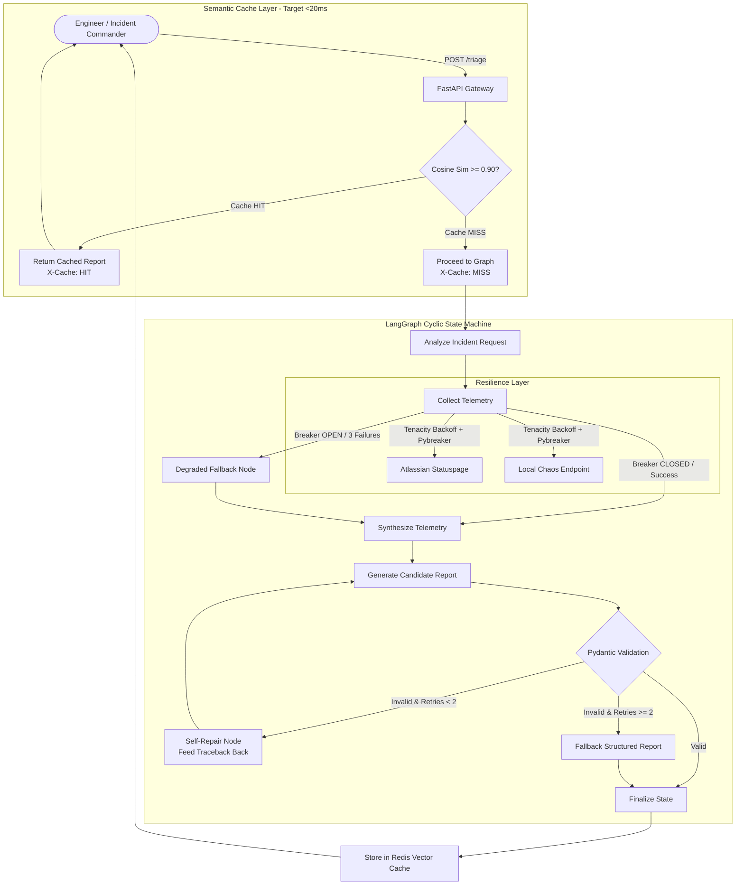

# resilient-triage

> **Fault-tolerant incident triage agent that doesn't fall apart when external systems are actively on fire.**

[](https://www.python.org/downloads/)
[](https://fastapi.tiangolo.com)
[](https://langchain-ai.github.io/langgraph/)
[](https://docs.pydantic.dev/)
[](https://orbstack.dev)

---

## Overview

When major incidents strike, critical monitoring tools, status pages, and upstream dependencies often degrade or crash simultaneously. Most naive AI triage bots exacerbate outages by hanging on dead sockets, tripping rate limits, or failing with unhandled exceptions.

`resilient-triage` is engineered from the ground up to **gracefully degrade**, **absorb transient shocks**, and **self-heal**:

- **FastAPI + LangGraph Cyclic State Machine**: Orchestrates multi-step triage flows, handles tool execution, and dynamically routes around broken dependencies.
- **Tenacity Exponential Backoff & Jitter**: Protects telemetry tools against transient timeouts, HTTP 503s, and HTTP 429 rate limits.
- **Pybreaker Circuit Breakers**: Isolates failing upstream dependencies (`fail_max=3`). When a service trips, the graph immediately routes into a degraded fallback node rather than stalling requests.
- **Pydantic Validation & Self-Repair Loop**: Parses LLM outputs strictly into `IncidentTriageReport`. Any `ValidationError` feeds the stack trace back into the model for iterative self-repair (capped at 2 retries).
- **Redis Semantic Caching**: Employs vector search in front of the graph. Similar queries ($\ge 0.90$ cosine similarity) return cached reports in sub-20ms with `X-Cache: HIT`.
- **Dual Telemetry Inputs**: Correlates live external status signals (real Atlassian Statuspage endpoints like GitHub Status) with a configurable `/chaos` endpoint to inject faults and verify circuit breaker behaviors.

---

## Architecture



---

## Quick Start

### Prerequisites
- **Python 3.12+**
- **OrbStack** (recommended on macOS) or **Docker Desktop**

### 1. Local Development Setup

```bash
# Clone the repository
git clone https://github.com/SamSilmarilData/resilient-triage.git
cd resilient-triage

# Create and activate Python 3.12 virtual environment
python3.12 -m venv .venv
source .venv/bin/activate

# Install dependencies in editable mode
pip install -e ".[test]"

# Copy environment template
cp .env.example .env
```

### 2. Running with Docker Compose / OrbStack

```bash
# Start Redis Stack (with RediSearch) and the triage service
docker compose up -d

# Verify containers are healthy
docker compose ps
```

### 3. Run Automated Tests

```bash
pytest tests/ -v
```

---

## Project Structure

```
resilient-triage/
├── Dockerfile                   # Python 3.12-slim container with health checks
├── docker-compose.yml           # Compose spec with redis-stack-server and API service
├── pyproject.toml               # Build configuration and dependencies
├── .env.example                 # Default environment configuration
├── CHANGELOG.md                 # Version tracking and release notes
├── docs/                        # Architecture and contract documentation
│   ├── architecture.md          # In-depth system design & resilience mechanics
│   └── schemas.md               # Pydantic models and data contracts
├── src/
│   └── resilient_triage/
│       ├── __init__.py
│       ├── config.py            # Centralized pydantic-settings
│       ├── schemas/             # Strict data contracts
│       │   ├── __init__.py
│       │   ├── incident.py      # IncidentTriageReport, enums, impact models
│       │   ├── telemetry.py     # Statuspage and Chaos models
│       │   ├── state.py         # LangGraph TriageState definition
│       │   └── api.py           # API request & response schemas
│       ├── resilience/          # Tenacity and Pybreaker wrappers (Phase 2)
│       ├── telemetry/           # Statuspage & Chaos clients (Phase 2)
│       ├── cache/               # Redis semantic vector cache (Phase 3)
│       ├── graph/               # LangGraph nodes and cyclic state machine (Phase 4)
│       └── api/                 # FastAPI routes and middleware (Phase 5)
└── tests/
    └── test_schemas.py          # Schema validation and error handling tests
```

---

## Roadmap

- [x] **Phase 1: Project Scaffolding & Schemas**
  - Python 3.12 environment setup.
  - Containerization for OrbStack and Docker.
  - Strict Pydantic v2 schemas and validation test suite.
- [x] **Phase 2: Resilience Layer & Telemetry Inputs**
  - Tenacity retry wrappers with exponential backoff & jitter.
  - Pybreaker circuit breakers with 3-failure trip limit.
  - Live Atlassian Statuspage and configurable `/chaos` endpoint.
- [ ] **Phase 3: Redis Semantic Caching**
  - Sub-20ms vector similarity lookups ($\ge 0.90$ cosine similarity).
  - Cache response headers (`X-Cache: HIT / MISS`).
- [ ] **Phase 4: LangGraph Cyclic State Machine**
  - Dynamic routing with degraded fallback node.
  - LLM self-repair retry loop for malformed schemas (max 2 retries).
- [ ] **Phase 5: FastAPI Application & End-to-End Resilience Suite**
  - Expose API endpoints and interactive OpenAPI docs.
  - Chaos injection test suite validating end-to-end fault tolerance.

---

## License

MIT License. See [LICENSE](LICENSE) for details.