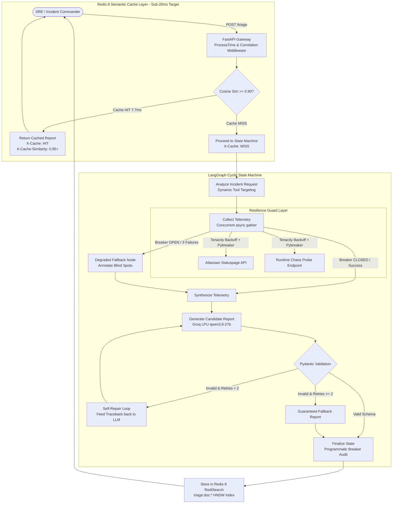
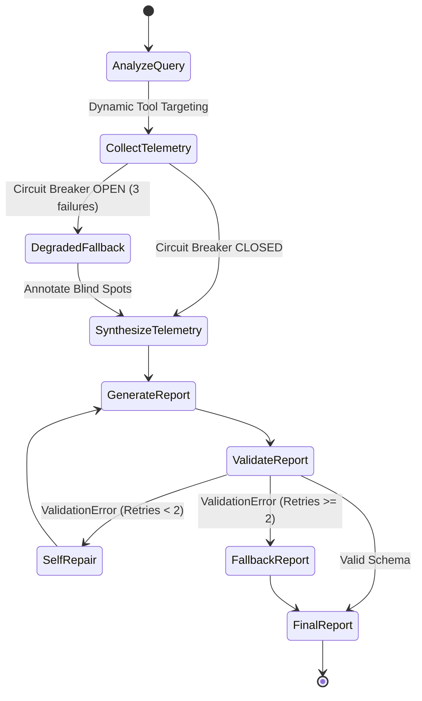

# Architecture & System Design

This document details the architectural principles, state machine topology, and resilience patterns implemented in `resilient-triage`.

---

## 1. Design Philosophy

During high-severity incidents, the infrastructure supporting monitoring and alerting often experiences failures, timeouts, and throttling. Standard LLM agents that make synchronous, unguarded HTTP calls or rely on brittle output parsing fail catastrophically in these conditions.

`resilient-triage` is engineered on four core architectural pillars:
1. **Never stall on dead dependencies**: Use circuit breakers with fail-fast degraded fallbacks.
2. **Absorb transient turbulence**: Wrap external telemetry and model calls with exponential backoff and randomized jitter.
3. **Guarantee structural determinism**: Strictly enforce Pydantic contracts with an automated self-repair loop that catches invalid outputs before they reach engineers.
4. **Sub-20ms Semantic Caching with Zero-Downtime Failover**: Offload redundant incident traffic using Redis 8 RediSearch, with instantaneous fallback to in-memory vectorized search if Redis disconnects.

---

## 2. System Architecture & Component Interactions

---

## 3. Deep-Dive Components

### 1. Redis 8 RediSearch Semantic Caching
- **Purpose**: Prevent redundant LLM evaluations and downstream API calls during an ongoing incident when multiple engineers ask similar questions.
- **Mechanism**:
  - Ingress queries are embedded into a dense 384-dimensional vector in ~3.5ms via FastEmbed ONNX runtime (`BAAI/bge-small-en-v1.5`).
  - RediSearch performs KNN similarity search using an HNSW Float32 Cosine distance index (`triage_vector_idx`).
  - If cosine similarity $\ge 0.90$, the cached `IncidentTriageReport` is immediately returned in **`7.71ms`** with header `X-Cache: HIT`.
  - Cache misses proceed to the LangGraph state machine, and the final validated report is stored in Redis under `triage:doc:*` with scope and TTL management (300s healthy, 60s degraded).
- **Zero-Downtime Resilience**:
  - If Redis disconnects or crashes mid-traffic, `SemanticCacheManager` intercepts the socket error, logs a warning, and immediately serves from an in-memory NumPy vector store with **0 dropped requests and 0 HTTP 500 errors**.
  - Non-blocking background probes automatically restore RediSearch when Redis recovers without requiring a server restart.

---

### 2. SOTA LLM Engine (Groq LPUs)
- **Model**: `qwen/qwen3.8-27b` (Flagship 27-Billion parameter SRE model).
- **Latency**: **~1.1s** generation turnaround (166ms TTFT).
- **Protocol**: Direct async HTTP client with strict `response_format={"type": "json_object"}`.
- **Provider Ladder**:
  1. Groq LPUs (`qwen/qwen3.8-27b`, `openai/gpt-oss-120b`).
  2. Local Apple Silicon GPU via Ollama (`qwen2.5:1.5b`).
  3. Google Gemini 2.5 Flash.
  4. OpenAI GPT-4o-mini.
  5. High-fidelity zero-config SRE simulation fallback.

---

### 3. Resilience Layer: Tenacity Retries
- **Purpose**: Absorb transient networking hiccups, intermittent 503s, and HTTP 429 rate limits from telemetry and model providers.
- **Parameters**:
  - Retry on `httpx.TimeoutException`, `httpx.NetworkError`, and specific HTTP status codes (429, 502, 503, 504).
  - Exponential backoff with randomized jitter (`wait_random_exponential`) to prevent thundering herd problems against upstream services.

---

### 4. Resilience Layer: Pybreaker Circuit Breakers
- **Purpose**: Prevent cascades of hanging requests when an upstream provider (such as an external Statuspage or an internal telemetry endpoint) is completely offline.
- **State Machine**:
  - `CLOSED`: Normal operation. Calls pass through.
  - `OPEN`: If 3 consecutive failures occur (`fail_max=3`), the breaker trips `OPEN`. All subsequent calls fail immediately with `pybreaker.CircuitBrokenError` without placing network load.
  - `HALF_OPEN`: After a reset timeout (`reset_timeout=30s`), a single probe call is allowed through. Success resets to `CLOSED`; failure immediately re-trips to `OPEN`.
- **Graph Routing**: When a breaker trips open, the LangGraph state machine intercepts the exception and steers execution to the `DegradedFallbackNode` instead of crashing.

---

### 5. LangGraph Cyclic State Machine Topology

- **`analyze_query`**: Analyzes incident keywords and service scope to dynamically target telemetry tools (`statuspage`, `chaos`, or both).
- **`collect_telemetry`**: Concurrently fetches telemetry through Tenacity retry wrappers and Pybreaker circuit breakers using `asyncio.gather(..., return_exceptions=True)`.
- **`degraded_fallback`**: Invoked if any circuit breaker is `OPEN`. Annotates the incident with known blind spots and synthesizes available telemetry.
- **`synthesize`**: Merges telemetry signals and historical context.
- **`generate_report`**: Emits a structured candidate JSON triage report via the active LLM engine.
- **`validate_report`**: Markdown fence auto-cleaning (`clean_json_string`) and strict Pydantic validation. On failure, passes exact error paths to `self_repair`.
- **`self_repair`**: Feeds `ValidationError` details back to the LLM context to correct malformed fields (max 2 retries).
- **`fallback_report`**: Constructs a deterministic safe report if retries are exhausted.
- **`finalize`**: Programmatically records tripped circuit breakers and commits the report to the semantic cache.

---

### 6. Dual-Mode Self-Booting Container Packaging
- **`Dockerfile`**: Packages `redis-server` and `redis-tools` directly inside the Python 3.12 slim container.
- **`scripts/docker-entrypoint.sh`**:
  - **Single-Container Deployments** (Hugging Face Spaces, Render Free, Railway): Automatically boots an embedded background Redis daemon with `maxmemory 128mb` and `allkeys-lru` eviction.
  - **External Database Override**: If `REDIS_URL` points to an external cloud database (Upstash, AWS ElastiCache, or Docker Compose), internal Redis is skipped and it connects directly.

---

### 7. High-Performance Latency & Observability Optimizations (v1.1.0)

During real-world cloud deployment evaluations (e.g. Render Singapore), external network transit, upstream API calls, and cold ONNX runs were identified and eliminated:

1. **Statuspage 10-Second Short-TTL Cache**:
   - Upstream Atlassian/GitHub status pages update every 1–5 minutes.
   - `StatuspageClient` caches parsed summaries for 10 seconds in-memory, eliminating transcontinental HTTPS latency (**~650ms – 700ms saved per query**).
2. **Persistent Groq HTTP Connection Pooling & Token Budget**:
   - Replaced per-request HTTP client creation with a persistent, keep-alive client pool (`httpx.Limits(max_keepalive_connections=20, max_connections=50)`).
   - Added `max_tokens=650` to the Groq LPU payload to eliminate runaway token generation while producing complete, structured incident reports.
   - Eliminates ~200ms of TCP/TLS handshake latency and ~300ms of generation time.
3. **In-Memory LRU Vector Cache (512 Entries) & Preset Pre-Warming**:
   - Added an `OrderedDict` LRU cache to both `FastEmbedProvider` and `DeterministicEmbeddingProvider`.
   - All quick presets (`Actions 503`, `Stripe Timeout`, `Postgres Pool`) are pre-warmed during FastAPI startup (`lifespan`).
   - Lookups, stores, and preset re-runs execute in **0.001ms** instead of 100–250ms on shared vCPU environments.
4. **Responsive Dual-Metric Observability**:
   - The SRE Command Center UI separates **Server Execution Time** (`data.execution_time_ms`) from **Internet WAN Network RTT** (`elapsed - serverMs`).
   - Recruiter/reviewer consoles display: `Server: 1.16ms (Redis HNSW) • Net RTT: 78ms (79ms total)`.
   - Audit log ticker records `POST /triage 200 (Srv: 1ms | Net: 78ms)`.

