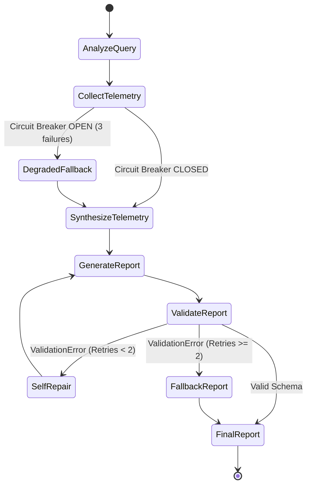

# Architecture & Design

This document details the architectural principles and resilience patterns implemented in `resilient-triage`.

## Design Philosophy

During high-severity incidents, the infrastructure supporting monitoring and alerting often experiences failures, timeouts, and throttling. Standard LLM agents that make synchronous, unguarded HTTP calls or rely on brittle output parsing fail catastrophically in these conditions.

`resilient-triage` is built on three core pillars:
1. **Never stall on dead dependencies**: Use circuit breakers with fail-fast degraded fallbacks.
2. **Absorb transient turbulence**: Wrap external telemetry calls with exponential backoff and randomized jitter.
3. **Guarantee structural determinism**: Strictly enforce Pydantic contracts with an automated self-repair loop that catches invalid outputs before they reach engineers.

---

## System Components

### 1. Redis Semantic Caching
- **Purpose**: Prevent redundant LLM evaluations and downstream API calls during an ongoing incident when multiple engineers ask similar questions.
- **Mechanism**:
  - Ingress queries are embedded into a dense vector.
  - Redis RediSearch performs vector similarity search against previous incident queries.
  - If cosine similarity $\ge 0.90$, the cached `IncidentTriageReport` is immediately returned in **sub-20ms** with header `X-Cache: HIT`.
  - Cache misses proceed to the LangGraph state machine, and the final validated report is stored in Redis with a configurable TTL.

### 2. Resilience Layer: Tenacity Retries
- **Purpose**: Absorb transient networking hiccups, intermittent 503s, and HTTP 429 rate limits from telemetry providers.
- **Parameters**:
  - Retry on `httpx.TimeoutException`, `httpx.NetworkError`, and specific HTTP status codes (429, 502, 503, 504).
  - Exponential backoff with randomized jitter to prevent thundering herd problems against upstream services.

### 3. Resilience Layer: Pybreaker Circuit Breakers
- **Purpose**: Prevent cascades of hanging requests when an upstream provider (such as an external Statuspage or an internal telemetry endpoint) is completely offline.
- **State Machine**:
  - `CLOSED`: Normal operation. Calls pass through.
  - `OPEN`: If 3 consecutive failures occur (`fail_max=3`), the breaker trips `OPEN`. All subsequent calls fail immediately with `pybreaker.CircuitBrokenError` without placing network load.
  - `HALF_OPEN`: After a reset timeout (`reset_timeout=30s`), a single probe call is allowed through. Success resets to `CLOSED`; failure immediately re-trips to `OPEN`.
- **Graph Routing**: When a breaker trips open, the LangGraph state machine intercepts the exception and steers execution to the `DegradedFallbackNode` instead of crashing.

### 4. LangGraph Cyclic State Machine
The core triage decision logic runs inside a compiled LangGraph cyclic graph:
- **`analyze_query`**: Extracts target services, symptoms, and urgency.
- **`collect_telemetry`**: Concurrently fetches telemetry from Statuspage and internal chaos probes through the resilience guards.
- **`degraded_fallback`**: Invoked if any circuit breaker is `OPEN`. Annotates the incident with known blind spots and synthesizes available telemetry.
- **`generate_report`**: Synthesizes telemetry signals into a structured incident report.
- **`validate_report`**: Parses the output into `IncidentTriageReport`.
  - On success: Emits the report and saves to semantic cache.
  - On failure: If attempts $< 2$, routes to `self_repair` node. If attempts $\ge 2$, constructs a safe fallback report.
- **`self_repair`**: Formats Pydantic's `ValidationError` details into the LLM context, instructing the model to fix invalid fields/enums.

### 5. Dual Telemetry Inputs
1. **Atlassian Statuspage**: Fetches real-world public incident feeds (such as GitHub Status at `/api/v2/summary.json`) to correlate global infrastructure outages.
2. **Local Chaos Endpoint (`/chaos`)**: A controllable diagnostic probe that allows operators to inject configurable latencies and 503 service outages on demand to verify that the circuit breaker trips and the agent gracefully degrades.
